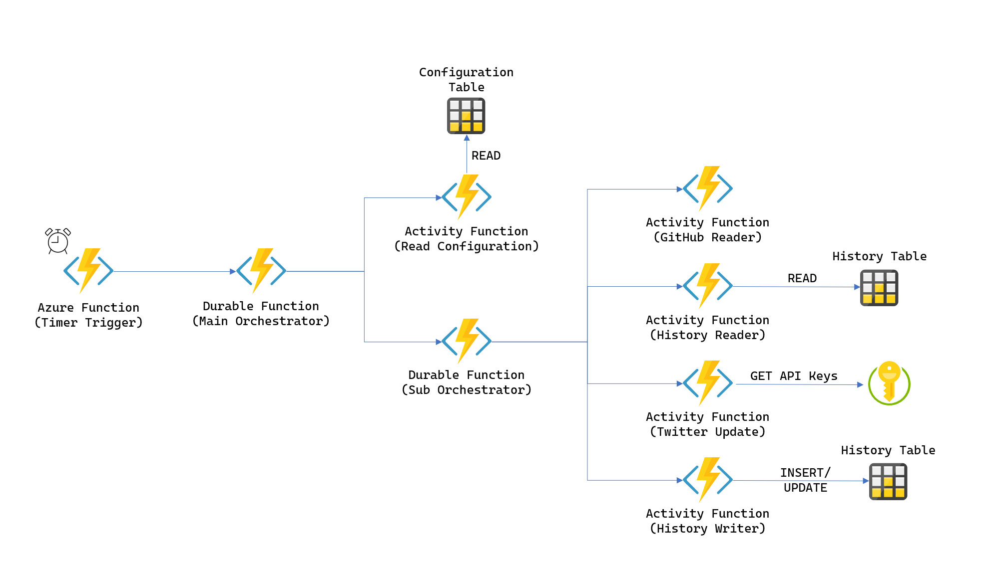

# Kyma Update Twitter Bot

## Intention

This is the code for the Twitter bot of the account [kyma-updates](https://twitter.com/KymaUpdates). This is an unofficial project by a Kyma fan, so no direct relation to or support by the official [Kyma project](https://kyma-project.io/).
## Architecture Overview

The Twitter Bot is developed makinguse of Azure Functions i.e. the Azure Durable Functions extension. the following picture gives you an overview about the components:

## Technical Details

You find the technical details about the solution in the blog post [Say Hello to the Kyma Update Twitter Bot via Azure Durable Functions](https://dev.to/lechnerc77/say-hello-to-the-kyma-update-twitter-bot-by-azure-durable-functions-4e1a) available on [dev.to](https://dev.to/).

## Watched Repositories

The Twitter bot watches the following repositories:

| _Repository Owner_ | _Repository Name_ | _Link_
| ---                | ---               | ---
| kyma-project       | kyma              | <https://github.com/kyma-project/kyma>
| kyma-project       | cli               | <https://github.com/kyma-project/cli>
| SAP                | Luigi             | <https://github.com/SAP/luigi>